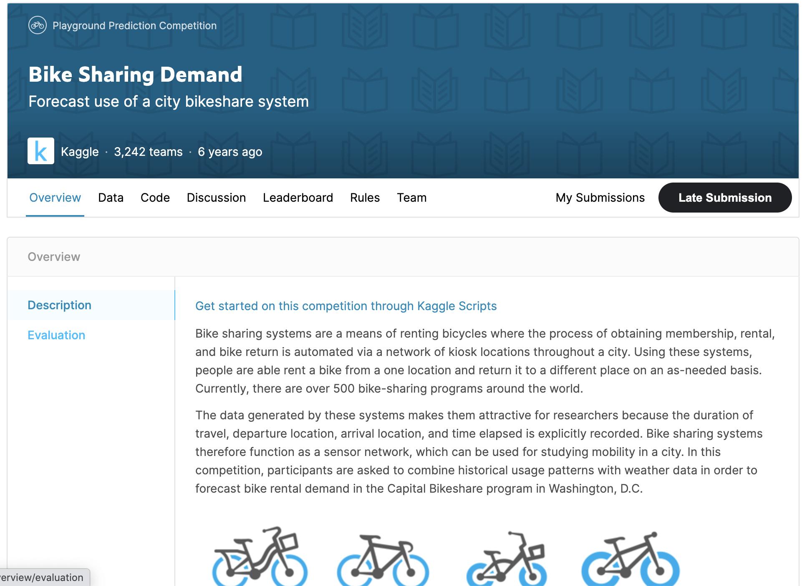

# predict-bike-sharing-demand-with-autogluon
#### we present a solution using AutoGluon to predict bike sharing demand. Bike sharing programs have gained popularity in urban areas
#### Bike-sharing demand is highly relevant to related problems companies encounter, such as Uber, Lyft, and DoorDash. Predicting demand not only helps businesses prepare for spikes in their services but also improves customer experience by limiting delays.

