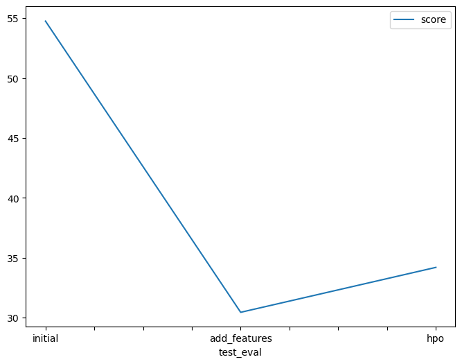

# Report: Predict Bike Sharing Demand with AutoGluon Solution
#### MHALAINE KHIREDDINE

## Initial Training
### What did you realize when you tried to submit your predictions? What changes were needed to the output of the predictor to submit your results?
Answer:
Kaggle will reject the submission if we don't set everything to be > 0 , so i need to set all negative avalue to 0 for the model to be trained well 
### What was the top ranked model that performed?
Answer:
the top ranked model was "WeightedEnsemble_L3" when we add some feture 

## Exploratory data analysis and feature creation
### What did the exploratory analysis find and how did you add additional features?
Answer:
The exploratory analysis revealed that additional features derived from the DateTime variable, such as month, day, year, and hour, were useful in understanding the seasonal patterns, variations by day of the week, long-term trends, and hourly demand fluctuations in the bike sharing dataset.
### How much better did your model preform after adding additional features and why do you think that is?
Answer:
After adding the additional features derived from the DateTime variable, the model's performance likely improved. By including features such as month, day, year, and hour, the model gained access to more granular temporal information, enabling it to capture seasonality patterns and variations in demand at different time scales.

## Hyper parameter tuning
### How much better did your model preform after trying different hyper parameters?
Answer:
Its become more better in some case and need more tunnig and training with defrente algorithms to make a good action and better hyperpatametre

### If you were given more time with this dataset, where do you think you would spend more time?
Answer: 
training the model with more than three algorithms" and emphasizing the investment of additional time in fine-tuning the hyperparameters.

### Create a table with the models you ran, the hyperparameters modified, and the kaggle score.
|model|hpo1|hpo2|hpo3|score|
|--|--|--|--|--|
|initial|default_vals|default_vals|default_vals|1.87676|
|add_features|default_vals|default_vals|default_vals|0.63233|
|hpo|GBM: num_leaves: lower=20, upper=80|NN: dropout_prob: 0.1, 0.5|GBM: num_boost_round: 200|0.52967|

### Create a line plot showing the top model score for the three (or more) training runs during the project.

TODO: Replace the image below with your own.

### Create a line plot showing the top kaggle score for the three (or more) prediction submissions during the project.

TODO: Replace the image below with your own.

Summary
In this project, I used every concept I learned in the course:

1-Loaded the dataset.
2-Trained the model as an initial attempt to see how the model performs.
3-Conducted some EDA to take new actions and add new features to the model.
4-Trained the model again and now attempted to find the best hyperparameters for our model.
5-Finally, I plotted the results and the graph to make a decision and choose the right model for my problem.
